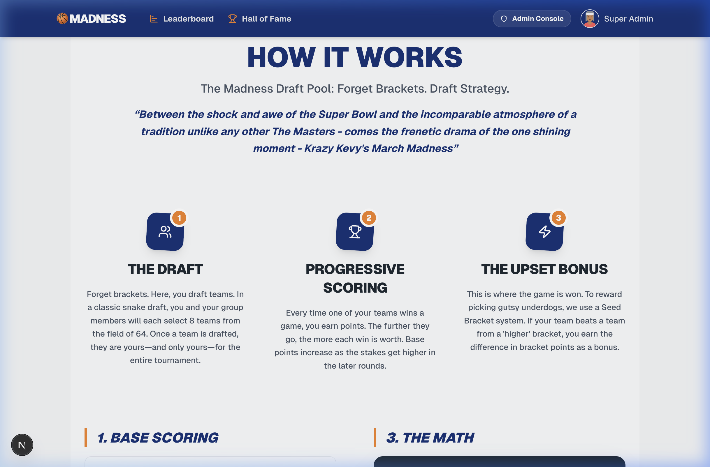
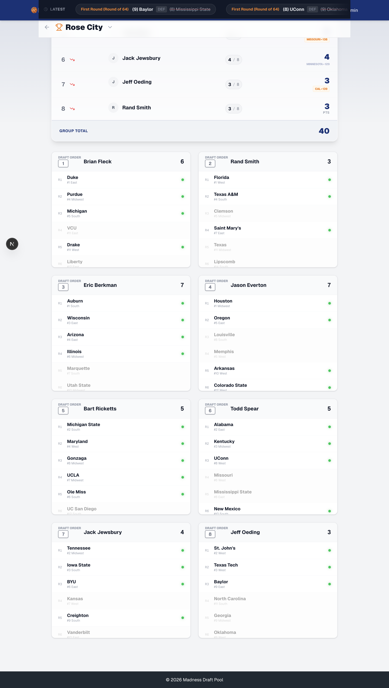
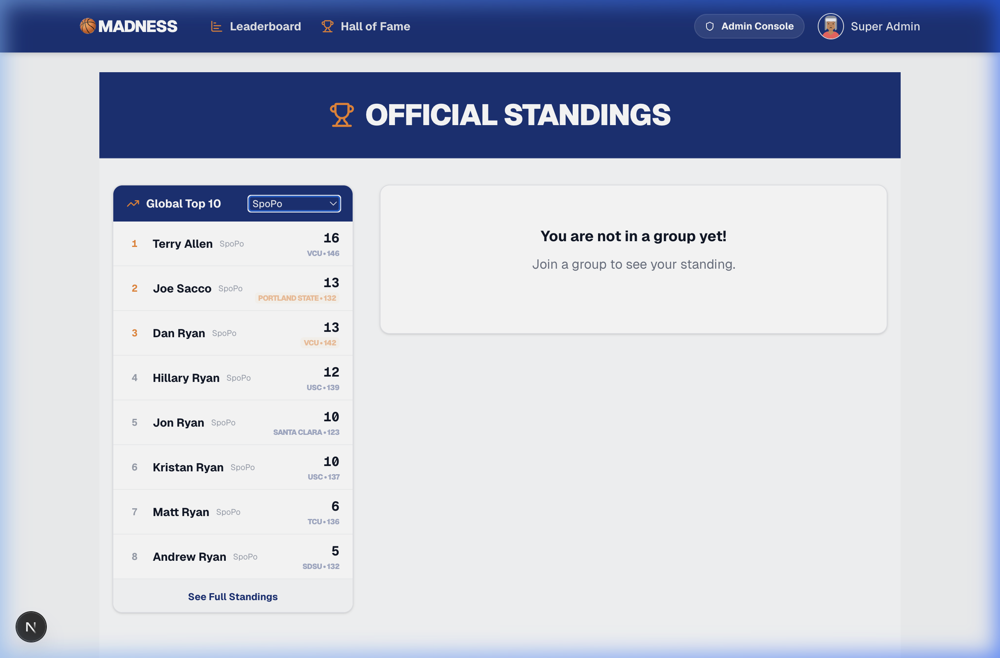
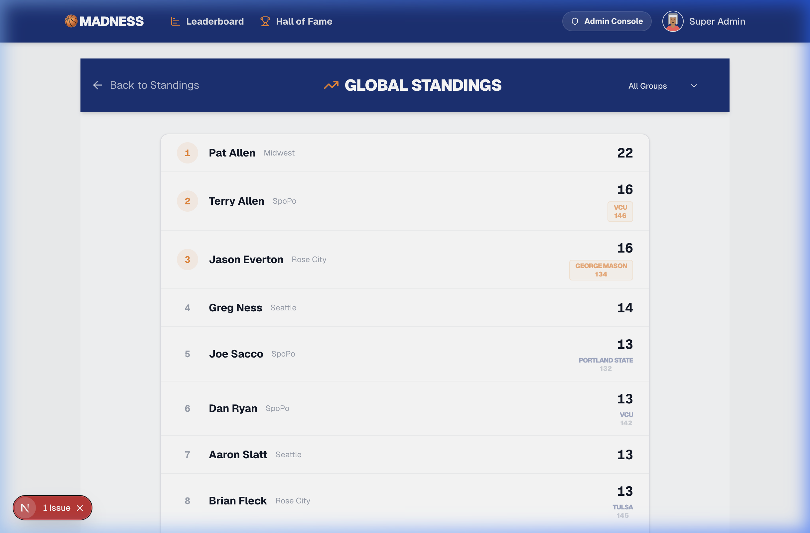
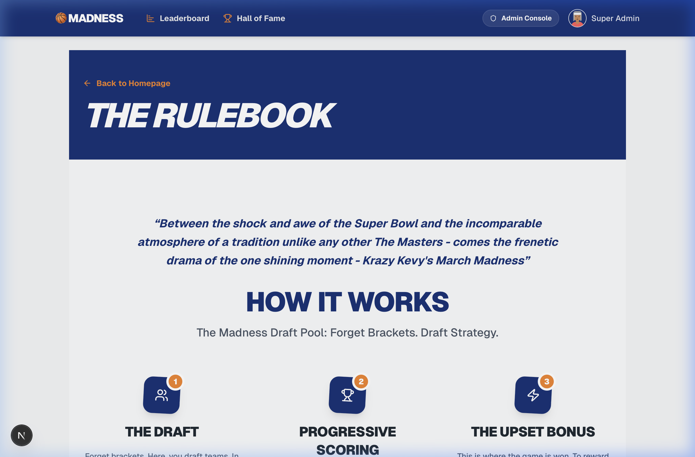

# Walkthrough - Dashboard & Group Fixes (Sprint 5-10)

I have completed several requested updates to the `/about` page and the group dashboard, specifically addressing membership and scoring issues in the "Rose City" group.

## 1. About Page Update
Added a quote from Krazy Kevy to the Rulebook page.
> "Between the shock and awe of the Super Bowl and the incomparable atmosphere of a tradition unlike any other The Masters - comes the frenetic drama of the one shining moment - Krazy Kevy's March Madness"

---

## 2. Group Dashboard & Membership Fixes
Fixed several issues reported in the "Rose City" group and updated the player cards UI.

### Membership Swap
Replaced incorrect members in "Rose City" while preserving their draft picks and positions:
- **Dan Ryan** replaced by **Eric Berkman** (eb@test.com)
- **Jon Ryan** replaced by **Rand Smith** (rb@test.com)

### Score Recalculation
Ran a system-wide script to recalculate and sync group membership scores with actual game results. This fixed the "0" scores reported in the "Rose City" and "Midwest" groups.

### UI Update: Draft Order & Sorting
Updated player cards to display **Draft Order** (the sequence in which they picked) instead of their current rank. The cards are now **sorted by Draft Order** (1, 2, 3...) to clearly show the flow of the draft, while the Live Standings table remains sorted by current Score/Rank.

---

---

## 4. Final Refinements

### Leaderboard Tie-Breaker Logic
Restricted the "orange blinking" animation to only apply to players tied for **1st or 2nd place**. This keeps the focus on the actual high-stakes competition.
- **Global Top 10**: The same highlighting logic now applies to the global top 10 box on the standings page.
- **Global Standing Page**: The `/leaderboard/global` page now displays complete tie-breaker information (school and score) for all players.

### Admin Games: Round Dropdown Fix
Fixed a UI glitch where the round dropdown would reset to "First Round" after recording a game result in later rounds. It now stays in sync with your currently selected round.

### About Page Layout
Moved the Krazy Kevy quote to be positioned **above** the "HOW IT WORKS" header on the about page for better flow.

## Changes
- `src/components/landing/HowItWorks.tsx`: Repositioned quote and adjusted spacing.
- `src/app/leaderboard/page.tsx`: Refined `isTied` logic to target top 2 score groups only.
- `src/app/leaderboard/global/page.tsx`: Added tie-breaker display and refined highlighting.
- `src/components/admin/GameResultForm.tsx`: Fixed round synchronization issue.
- `src/app/admin/tournaments/[id]/teams/page.tsx`: Fixed import link and integrated `EditableTeamName`.
- `src/components/admin/EditableTeamName.tsx`: Client component for inline editing.
- `src/app/actions/tournament.ts`: Added `updateTeamName` server action.
