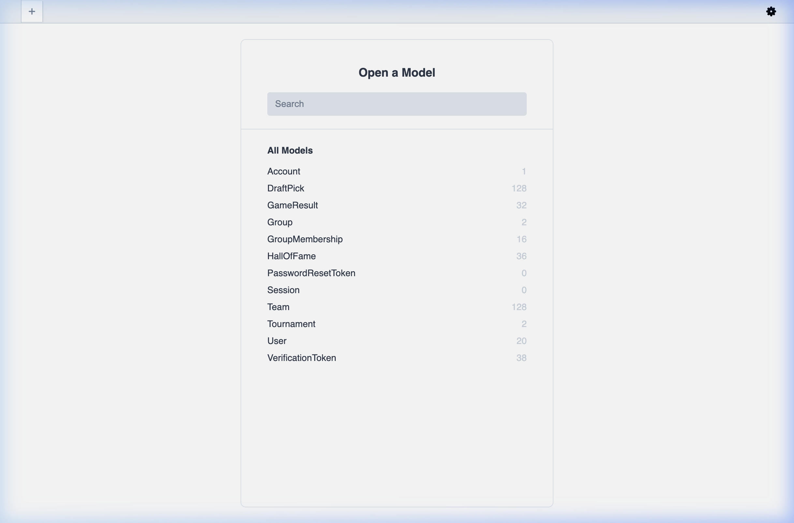
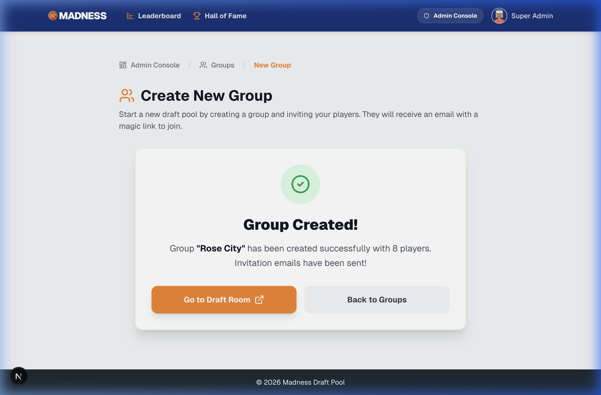

# Madness 2026 Admin Improvements

## Prisma Studio Setup
Configured and verified Prisma Studio for easier database management.

### Changes Made
- Added convenience scripts to [package.json](file:///Users/dan/Developer/madness-2026/package.json):
  - `npm run db:studio`: Opens the Prisma Studio visual editor.
  - `npm run db:generate`: Regenerates the Prisma Client.
  - `npm run db:seed`: Seeds the database.

---

## New Group Creation Improvements
Added robust validation and improved user feedback to the admin group creation flow.

### Changes Made
- **Client-Side Validation**:
    - Ensures all 8 player slots are filled with both names and emails before submission.
    - Validates email formats using regex.
    - Specific error messages pointing out exactly which slot is missing data.
- **Server-Side Updates**:
    - Modified `createGroupWithPlayers` action to return the new group ID.
    - Fixed transaction scope issues to ensure group data is accessible for the return value.
- **Enhanced Success UI**:
    - Replaced basic message with a dedicated success screen.
    - Included direct links to the **Draft Room** and **Groups Management** page.

### Verification Results
- Verified that incomplete forms trigger specific warnings (e.g., "Slot #3 is incomplete").
- Verified that invalid emails are caught before submission.
- Verified the success screen correctly identifies the group name and links to the correct draft board.

---

## Default Tournament Filter
Improved the administrative experience by defaulting dashboard views to the most recent tournament.

### Changes Made
- **Dashboard Defaulting**:
    - The `/admin` and `/admin/groups` pages now automatically filter to the most recent tournament when no specific filter is provided.
    - Updated UI pills to highlight the active tournament selection correctly.
    - Added an explicit "All" state to allow viewing groups across all history if needed.
- **Component Updates**:
    - Enhanced the `TournamentFilter` dropdown to handle the "All" state and reflect the system default selection.

### Verification Results
- Verified on the live dashboard that the "Test 2025" tournament is selected by default.
- Verified that "All Tournaments" correctly aggregates groups from all tournaments.
